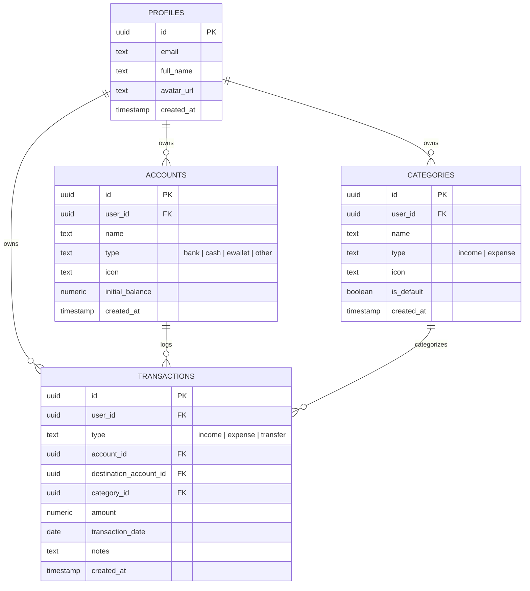

<div align="center">

  

  <p align="center">
    <strong>Aplikasi Pencatatan Keuangan Pribadi Modern, Cepat, dan Elegan</strong>
  </p>

  <p align="center">
    <a href="#-fitur-utama">Fitur</a> •
    <a href="#-tech-stack">Tech Stack</a> •
    <a href="#-tangkapan-layar">Tampilan</a> •
    <a href="#-panduan-instalasi">Instalasi</a> •
    <a href="#-skema-database">Database</a> •
    <a href="#-struktur-folder">Struktur</a>
  </p>

  <p align="center">
    
    
    
    
    
    
  </p>

</div>

---

## 📖 Tentang catat.in

**catat.in** adalah aplikasi web pencatatan keuangan pribadi (*personal finance tracker*) yang dirancang dengan pendekatan *mobile-first*, performa tinggi, dan estetika visual premium. Aplikasi ini memudahkan Anda mencatat arus kas harian, mengelola multi-rekening, serta memantau kesehatan finansial melalui visualisasi analitik interaktif.

---

## ✨ Fitur Utama

### 1. 💵 Pencatatan Transaksi Cerdas
- **Tipe Transaksi Lengkap:** Mendukung *Pemasukan (+)*, *Pengeluaran (-)*, dan *Transfer Internal (↔)* antar rekening.
- **Smart Validation:** Otomatis memvalidasi ketersediaan saldo sebelum pengeluaran atau transfer diproses.
- **Format Otomatis Rupiah:** Input nominal cerdas terformat langsung (*misal `50.000` tersimpan presisi `50000`*).
- **Pengelompokan Tanggal:** Riwayat transaksi dikelompokkan rapi per tanggal dengan tanggal ringkas (*misal `15 Agt`*).
- **Filter Periode Lengkap:**
  - 📅 **Hari Ini**
  - 📅 **Kemarin**
  - 📅 **7 Hari Terakhir**
  - 📅 **Bulan Ini** *(dengan navigasi bulan)*
  - 📅 **Tahun Ini** *(dengan navigasi tahun)*
  - 📅 **Custom Date Range** *(bebas tentukan tanggal awal & akhir)*

### 2. 🏦 Manajemen Multi-Rekening
- Kelola berbagai jenis rekening: **Bank** (BCA, Mandiri, BRI, SeaBank, dll.), **Tunai**, dan **E-Wallet** (GoPay, OVO, Dana, ShopeePay).
- **Dynamic Balance Calculation:** Saldo dihitung *real-time* dari riwayat mutasi transaksi (*bukan sekadar cached state*).
- **Proteksi Data:** Mencegah penghapusan rekening yang masih memiliki riwayat transaksi aktif.
- **Halaman Detail Rekening:** Menampilkan mutasi khusus rekening tersebut beserta statistik pemasukan & pengeluaran bulanan.

### 3. 📊 Rekap & Analitik Keuangan
- **Kartu Ringkasan:** Indikator jelas untuk *Total Pemasukan*, *Total Pengeluaran*, dan kartu *Selisih* (*Net Cashflow*).
- **Donut Chart Interaktif (Recharts):** Visualisasi proporsi pengeluaran dan pemasukan dengan segmentasi warna yang dinamis.
- **Rincian Per Kategori:** Kartu visual per kategori yang dilengkapi persentase kontribusi dan nominal terformat.

### 4. 🏷️ Kategori Kustom Dinamis
- Kelola kategori pemasukan & pengeluaran sesuai kebutuhan.
- Tambah, edit nama, dan pilih ikon emoji kustom dari koleksi emoji yang variatif.

### 5. 🌓 Desain Modern (Emerald & Charcoal Dark)
- **Tema Terang & Gelap:** Warna *Charcoal Dark* (`#0d0f12`) pekat tanpa rona biru, dipadukan dengan aksen *Emerald Green* (`#064e3b`) dan *Mint* (`#5eead4` / `#86efac`).
- **Layout Responsif & Terkunci:** Penguncian lebar horizontal (*fixed viewport*) untuk mencegah pergeseran/goyang saat navigasi.
- **No Layout Shift:** Menggunakan `scrollbar-gutter: stable` sehingga topbar tetap kokoh tanpa getar saat berpindah halaman.

### 6. 🌐 Multi-Bahasa (i18n) & Personalisasi
- Pilihan bahasa: **Bahasa Indonesia** *(default)* dan **English**.
- **Notifikasi Pengingat Harian:** Menggunakan *Browser Notifications API* pada jam yang dapat disesuaikan.

### 7. 💾 Keamanan & Backup Data
- **Google OAuth Login:** Autentikasi aman melalui Supabase Auth.
- **PostgreSQL Row Level Security (RLS):** Data antar pengguna terisolasi 100% aman di tingkat database.
- **Backup & Restore JSON:** Unduh salinan seluruh data dan pulihkan kapan saja dengan validasi integritas struktur.
- **Ekspor CSV:** Unduh laporan transaksi dalam format CSV standar Excel (UTF-8 BOM).

### 8. 📲 Progressive Web App (PWA)
- Dapat diinstal (*installable*) langsung di Android, iOS, maupun Desktop layaknya aplikasi *native*.
- Dilengkapi *Service Worker* dan *Web App Manifest*.

---

## 🚀 Tech Stack

| Komponen | Teknologi | Deskripsi |
|---|---|---|
| **Framework** | [React 19](https://react.dev/) | Library UI modern dengan performa tinggi |
| **Language** | [TypeScript](https://www.typescriptlang.org/) | Type-safety untuk kode yang andal dan terstruktur |
| **Build Tool** | [Vite 6](https://vite.dev/) | Bundler super cepat dengan Hot Module Replacement (HMR) |
| **Styling** | [Tailwind CSS v4](https://tailwindcss.com/) + CSS Variables | Sistem token desain modern & responsif |
| **Database & Auth** | [Supabase](https://supabase.com/) | PostgreSQL, Google OAuth, & Row Level Security (RLS) |
| **Charts** | [Recharts](https://recharts.org/) | Grafik Donut Chart interaktif |
| **Icons** | [Lucide React](https://lucide.dev/) | Ikon vektor modern dan konsisten |
| **PWA** | [Vite Plugin PWA](https://vite-pwa-org.netlify.app/) | Dukungan Service Worker & instalasi aplikasi |

---

## 🛠️ Panduan Instalasi & Menjalankan Lokal

### 1. Prasyarat
Pastikan Anda telah menginstal:
- **Node.js** (versi 18 ke atas)
- **npm** atau **yarn** / **pnpm**
- Akun [Supabase](https://supabase.com/)

### 2. Clone Repositori
```bash
git clone https://github.com/username/catat.in.git
cd catat.in
```

### 3. Instal Dependensi
```bash
npm install
```

### 4. Konfigurasi Environment Variable
Salin file `.env.example` ke `.env`:
```bash
cp .env.example .env
```
Isi konfigurasi Supabase Anda di dalam file `.env`:
```env
VITE_SUPABASE_URL=https://your-project-id.supabase.co
VITE_SUPABASE_ANON_KEY=your-anon-public-key
```

### 5. Jalankan Server Pengembangan
```bash
npm run dev
```
Buka browser Anda di `http://localhost:5173`.

### 6. Build untuk Produksi
```bash
npm run build
```
Hasil build siap produksi akan berada di direktori `dist/`.

---

## 🗄️ Skema Database (Supabase PostgreSQL)

Aplikasi menggunakan tabel-tabel utama dengan **Row Level Security (RLS)** yang ketat:



---

## 📁 Struktur Folder Proyek

```
catat.in/
├── public/
│   ├── icons/                  # Logo & favicon aplikasi
│   └── manifest.webmanifest    # Konfigurasi PWA
├── src/
│   ├── components/             # Komponen UI modular
│   │   ├── accounts/           # Form & kartu rekening
│   │   ├── categories/         # Manajemen kategori
│   │   ├── layout/             # Pembungkus layout
│   │   ├── navigation/         # Topbar desktop & Bottom nav mobile
│   │   ├── recap/              # Donut chart & summary cards
│   │   ├── transactions/       # Item transaksi, filter bar, form
│   │   └── ui/                 # Reusable UI (Button, Input, BottomSheet, dll.)
│   ├── contexts/               # React Context (Auth, Theme, I18n, Toast)
│   ├── layouts/                # AppLayout & AuthLayout
│   ├── lib/                    # Client Supabase & konstanta
│   ├── locales/                # Dictionary multi-bahasa (ID & EN)
│   ├── pages/                  # Halaman aplikasi (Transactions, Accounts, Recap, Settings, dll.)
│   ├── services/               # Integrasi API & database query
│   ├── types/                  # Definisi TypeScript
│   ├── utils/                  # Format mata uang, tanggal, dan kalkulasi
│   ├── App.tsx                 # Routing aplikasi
│   ├── index.css               # Desain sistem tema & Tailwind CSS v4
│   └── main.tsx                # Entry point
├── index.html
├── package.json
├── tsconfig.json
└── vite.config.ts
```

---

## 📄 Lisensi

Didistribusikan di bawah Lisensi MIT. Lihat file `LICENSE` untuk informasi lebih lanjut.

---

<div align="center">
  Dibuat dengan ❤️ untuk kemudahan pengelolaan keuangan pribadi Anda.
</div>
